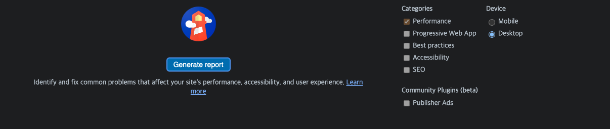
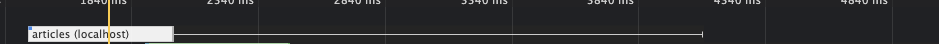
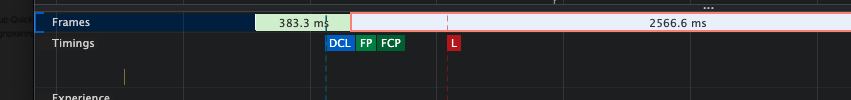
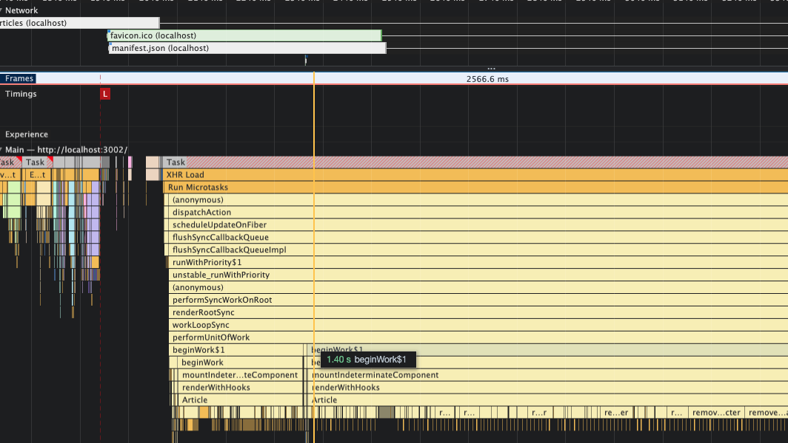

# 웹 성능 최적화 for React

로딩 성능: 서버에서 클라이언드로 다운로드 받는 성능 (이미지 사이즈 최적화, code split, 텍스트 압축)
렌더링 성능: 다운 받은 리소스들을 화면에 보여주는 성능 (bottleneck 코드 최적화)

## 분석툴

크롬

- 네트워크 탭 (네트워크 리소스 정보)
- 퍼포먼스 탭 (웹페이지 실행시 실행되는 모든 작업을 그래프로)
- 라이트 하우스 (성능적으로 어느 정도 수준인지)
- webpack bundle analyzer (웹팩으로 번들링된 파일들이 어떤 코드를 담고 있는지 보여준다)

generate report 버튼을 누른다.

- 이미지는 렌더링되는 과정
- Opportunities: 리소스 관점에서의 문제(로딩성능)와 향상 가이드 제공
- Diagnostics: 페이지 실행관점(렌더링 성능)과 향상 가이드
- PassedAudit: 제대로 적용된 항목들
- runtime settings: 검사환경

## 이미지 최적화

- 자체 서버: 직접 이미지 사이즈를 조절
- api로 받아 오는 이미지: 이미지 CDN을 이용

**CDN**
Contents Delivery Nework
물리적 거리의 한계를 극복하기 위해 소비자(사용자)와 가까운 곳에 컨텐츠 서버를 두는 기술

**image CDN**
이미지를 사용자에게 보내기 전에 특정 형태로의 처리과정을 거쳐서 보내 준다.

## bottlenect 최적화

회색 선은 callback을 나타낸다.

- DCL: domcontentloaded
- FP: First Paint
- FCP: First Content Paint
- L: onLoad

이 요소들이 있는 부분이 실제 화면에 그려지는 때

network의 회색선(callback)부분에서의 javascript code
그중 Article => 컴포넌트 명, 그 아래 remove....(Article 컴포넌트)안의 removeCharictor 함수실행, 이 함수 중간 중간 진한 노란색은 이 함수들이 너무 오래 사용되므로 가비지 컬랙터에 의해 끊은 모습이다.(메모리의 여유가 없을 때 메모리를 한번 정리 해준다)
